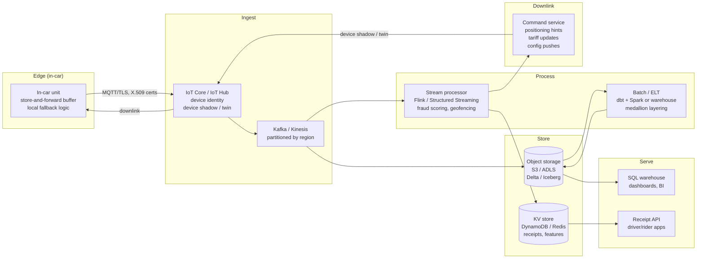

# Architecture

## 1. Sizing the problem

Before drawing boxes, size the workloads. The brief says 11,000 cars, 24/7/365,
operating globally.

| Stream | Calculation | Volume | Size |
|---|---|---|---|
| Trip events | 11k cars × ~27 trips/day | ~300k events/day, ~110M/yr | ~50 GB/yr (structured) |
| GPS telemetry | 11k cars × 1 ping/5s × 86,400s | ~190M events/day | ~5 TB/yr (compressed) |
| Receipts | 1 per trip | ~300k/day | negligible |
| Weather / external | hourly per city | <1k/day | negligible |

Trip events and GPS telemetry are **three orders of magnitude apart**. They have
different durability, latency, and cost profiles and must not share a pipeline.

---

## 2. Four workloads, four SLAs

The brief names four business needs. Each implies a different architecture:

| Workload | Latency | Durability | Key constraint |
|---|---|---|---|
| **Receipt generation** | Seconds | Must not lose a single trip | Exactly-once, auditable, regulatory |
| **Management metrics** | Hours | Replayable from source | Correctness over speed |
| **Fraud detection** | Sub-second | Can tolerate event loss | Low latency, feature freshness |
| **Taxi placement** | Minutes, **with return path to car** | Commands expire (TTL) | Bidirectional, offline-resilient |

The last row is the one most candidates miss. "Send data back to individual
cars" is not a batch pipeline — it is a command-and-control channel with
acknowledgement, expiry, and offline handling.

---

## 3. Architecture overview

---

## 4. Layer-by-layer design

### 4.1 Edge — the in-car unit

Each of 11,000 vehicles carries an onboard unit that:

- **Buffers locally** when connectivity is lost (tunnels, garages, dead zones).
  Events are persisted to local flash with a monotonic sequence number.
- **Transmits via MQTT over TLS** with X.509 client certificates — one cert per
  device, rotated via the IoT platform. MQTT is chosen over HTTP because it
  handles intermittent connectivity natively (QoS 1 for trip events, QoS 0 for
  telemetry).
- **Separates topics** by criticality: `vehicles/{id}/trips` (must-not-lose,
  QoS 1) vs `vehicles/{id}/telemetry` (lossy, QoS 0, sampled). This is a cost
  decision — ingesting 190M raw telemetry events/day is expensive, and most
  analytics work on 30-second or 1-minute aggregates.
- **Receives commands** via device shadow/twin: repositioning hints, tariff
  updates, geofence changes. The unit applies them locally and acknowledges.
  If the cloud is unreachable, the unit falls back to its last-known
  configuration.

### 4.2 Ingest — IoT Core / IoT Hub

Why a managed IoT platform rather than a bare Kafka topic:

- **Device identity and authentication.** 11,000 devices need provisioning,
  cert rotation, and revocation. IoT Core/Hub handles this; a Kafka cluster
  does not.
- **Device shadow / digital twin.** This is the mechanism for the downlink —
  the cloud writes a "desired" state, the device reads it and reports
  "reported" state. It is idempotent, tolerates disconnection, and is built
  into the platform.
- **Fan-out.** IoT Core rules or Event Grid route trip events to a durable
  stream (Kinesis / Event Hubs / MSK) and telemetry to a cheaper path
  (S3 direct put / ADLS).

See [ADR 0004](adr/0004-downlink.md) for the full downlink reasoning.

### 4.3 Stream processing

A stream processor (Flink or Spark Structured Streaming) sits on the durable
stream for two real-time workloads:

- **Fraud detection.** Features computed over sliding windows (trip velocity,
  fare vs distance ratio, repeated short trips from the same zone). Scored
  against a model served via a feature store or sidecar. Alerts are
  low-latency, not batch — a fraudulent trip in progress should be flagged
  before it ends.
- **Geofencing and dispatch.** Which vehicles are near a demand hotspot?
  Combined with the weather-demand model, this feeds the positioning service.

Event-time watermarks handle late-arriving data from vehicles that were offline.
A 5-minute watermark covers most tunnel/garage scenarios; events arriving after
the watermark land in a late-data side output for batch reconciliation.

### 4.4 Batch processing — the medallion lakehouse

This is the workload demonstrated in this project:

| Layer | Contents | Materialisation |
|---|---|---|
| **Bronze** | Raw landings, byte-faithful to the source | Append-only, partitioned by region + date |
| **Silver** | Conformed, typed, timezone-normalised, DQ-flagged | Table, deduplicated, quarantine rows preserved |
| **Gold** | Fact tables, aggregation marts | Table, joined with external data (weather, zones) |

Transformations are written as **dbt models** with a cross-engine abstraction
layer (`macros/cross_engine.sql`). The same models run against DuckDB locally
and Databricks in the cloud. See [ADR 0001](adr/0001-duckdb-and-databricks.md).

### 4.5 Storage

- **Object storage (S3 / ADLS)** with **Delta Lake** table format for ACID
  transactions, time travel, and `VACUUM` for GDPR erasure.
- **KV store (DynamoDB / Redis)** for sub-millisecond lookups: receipt
  retrieval by trip ID, fraud feature vectors, driver session state.
- Partitioning strategy: `region/year/month/day`. Region-first because of
  data residency requirements (see §5.1).

### 4.6 Serve

- **SQL warehouse** (Databricks SQL, Redshift, BigQuery) for management
  dashboards: revenue per city, trip length distributions, fleet utilisation.
  Refresh cadence: hourly or daily depending on the metric.
- **Receipt API** backed by the KV store. Idempotent: requesting the same
  receipt twice returns the same document. Receipts are generated as a
  side-effect of the trip-end event and are immutable once written.

### 4.7 Downlink — sending data back to the car

This is the most architecturally interesting requirement. The challenges:

1. **Command idempotency.** A "move to zone X" hint sent twice must not cause
   confusion. Commands carry a monotonic version; the device applies only if
   the version is newer than its current state.
2. **TTL.** A repositioning hint is worthless 10 minutes later. Commands carry
   an expiry timestamp; the device ignores expired commands, and the cloud
   garbage-collects them from the shadow.
3. **Ack/nack.** The device reports whether it applied the command. If it
   nacks (e.g. driver override, vehicle in service), the command service
   marks it as rejected and does not retry.
4. **Offline resilience.** If the vehicle is offline when a command is issued,
   the device shadow holds the desired state. When the vehicle reconnects, it
   reads the shadow and applies any non-expired commands. This is why device
   shadow is preferable to a push-only mechanism.
5. **Security.** Commands are signed. The in-car unit verifies the signature
   before applying. A compromised cloud credential should not be able to
   redirect a fleet.

Types of downlink messages:
- **Repositioning hints:** "demand is high in zone X" — advisory, not mandatory
- **Tariff updates:** new pricing for a zone or time window — must be applied
  before the next trip starts
- **Configuration:** geofence boundaries, app updates, cert rotation schedules

---

## 5. Cross-cutting concerns

### 5.1 Data residency and GDPR

A global taxi operator processes personal data: pickup/dropoff coordinates,
driver IDs, and potentially rider information. Under GDPR:

- **EU trip data must stay in the EU.** The architecture is region-partitioned:
  each major region (EU, US, APAC) has its own ingest and storage layer.
  Aggregates (revenue per city, fleet utilisation) are replicated globally;
  raw trip data is not.
- **Right to erasure.** Delta Lake supports `DELETE` by predicate + `VACUUM` to
  physically remove data. Driver and rider IDs are tokenised — a single token
  mapping table supports erasure without scanning the entire lake.
- **Data minimisation.** GPS telemetry is retained at full resolution for 30
  days (operational use), then downsampled to 1-minute aggregates and kept for
  12 months (analytics), then deleted.

### 5.2 Schema contracts

You cannot redeploy 11,000 in-car units on a Tuesday. Schema evolution must be
backward-compatible:

- Trip events and telemetry use **Avro or Protobuf** with a **schema registry**
  (Confluent or AWS Glue). New fields are added as optional with defaults.
  Removing a field requires a deprecation period (e.g. 90 days of dual-write).
- The IoT platform enforces schema validation at ingest — malformed messages
  are routed to a dead-letter topic, not silently dropped.
- dbt model contracts (`contracts: true` in dbt 1.5+) enforce column types and
  names at the transformation layer, catching drift before it reaches gold.

### 5.3 Cost management

| Component | Cost driver | Control lever |
|---|---|---|
| Telemetry ingest | 190M events/day | Sample at the edge (e.g. 1 ping/30s = 12× reduction) |
| Object storage | ~5 TB/yr raw telemetry | Tiered retention: hot 30d → warm 12mo → delete |
| Stream processing | Flink/Spark compute | Right-size parallelism; scale to zero overnight in low-traffic cities |
| SQL warehouse | Query volume | Materialised gold tables reduce scan cost; caching layer for dashboards |
| IoT platform | Connected devices × messages | QoS 0 for telemetry (no ack overhead); batch telemetry into 30s micro-batches |

### 5.4 Observability

- **Pipeline health:** row counts in vs out per layer per run, with alerting on
  drift (a 20% drop in bronze row count means an upstream problem, not cleaner
  data).
- **Data freshness:** SLA per workload — receipts within 30 seconds, fraud
  scores within 5 seconds, dashboards within 1 hour.
- **Fleet connectivity:** percentage of vehicles reporting in the last 5
  minutes, flagging prolonged outages for maintenance dispatch.

---

## 6. What was built vs what was designed

| Component | Status | Notes |
|---|---|---|
| Bronze → Silver → Gold pipeline | **Built** | DuckDB + dbt, 11/11 tests passing |
| Timestamp/timezone contract | **Built** | Python + SQL, 13 unit tests incl. DST |
| Data quality with quarantine | **Built** | 10 rules, real counts documented |
| Weather join and analysis | **Built** | Zone-level demand lift, 3 charts |
| CI pipeline | **Built** | GitHub Actions: ruff + pytest + dbt build |
| IoT ingest + device shadow | **Designed** | This document |
| Stream processing (fraud) | **Designed** | This document |
| Downlink command service | **Designed** | This document + ADR 0004 |
| Regional deployment | **Designed** | This document, §5.1 |

---

## 7. What I would do differently at scale

- **Add a second month** to validate that the weather-demand pattern is stable
  across seasons, not an artifact of January.
- **Replace ERA5 reanalysis with NOAA station observations** for auditability
  in production. See [ADR 0003](adr/0003-weather-source.md).
- **Implement the fraud detection stream** as a proof-of-concept with a simple
  rule engine before investing in ML scoring.
- **Add integration tests** that run the full pipeline against a fixture
  dataset in CI, not just unit tests and dbt model tests.
- **Cost modelling.** At 190M telemetry events/day, the difference between QoS 0
  and QoS 1, or between 5-second and 30-second sampling, is tens of thousands
  of dollars per month. This deserves a spreadsheet, not a guess.
