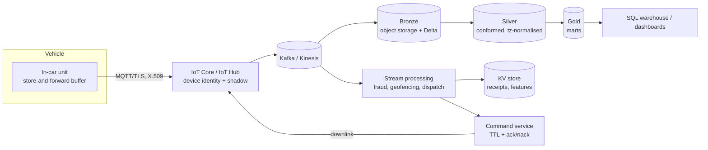

# Architecture

> Scaffold. Fill during days 9–11. The Mermaid diagram lives in-repo so it is
> version-controlled; export a PNG for the slides.

## Sizing the problem first

| Stream | Volume | Durability | Latency |
|---|---|---|---|
| Trip events | ~300k/day (11k cars × ~27 trips) ≈ 110M/yr | must not lose one | seconds |
| GPS telemetry | ~190M/day (1 ping / 5s / car) | lossy-tolerant | seconds |

Three orders of magnitude apart. They do not belong in the same pipeline.

## Four workloads, four SLAs

| Workload | Latency | Durability | Path |
|---|---|---|---|
| Receipt generation | seconds | exactly-once, auditable | trip-end → idempotent receipt service |
| Fraud detection | sub-second | lossy-tolerant | stream features → scoring |
| Management metrics | hours | replayable | lakehouse batch, medallion |
| Taxi placement | minutes + **downlink to car** | commands expire | stream → model → device shadow |

## Open questions to address
- Data residency: EU trip data cannot leave the EU. Process regionally,
  replicate aggregates globally.
- Schema contracts: you cannot redeploy 11,000 cars on a Tuesday.
- Cost: at 190M telemetry events/day, what is the sampling rate and retention tier?
